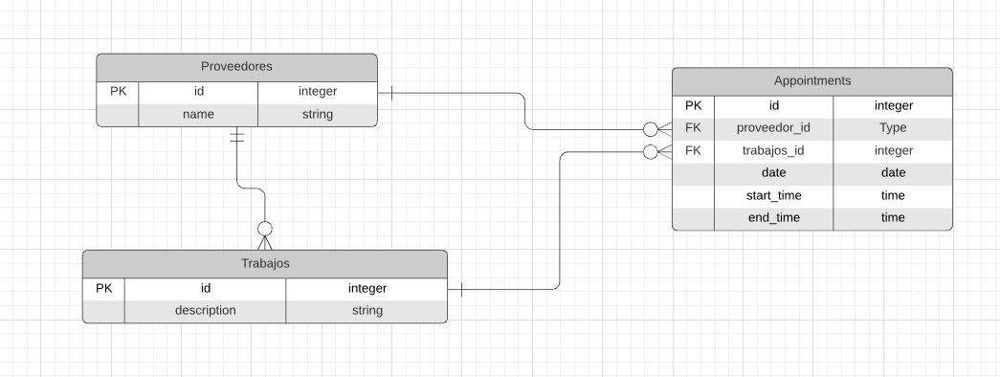
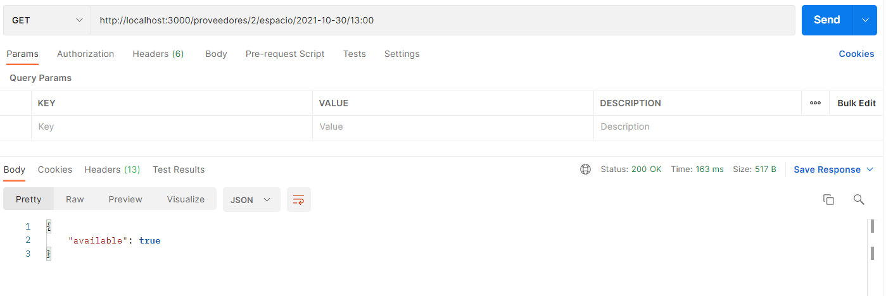
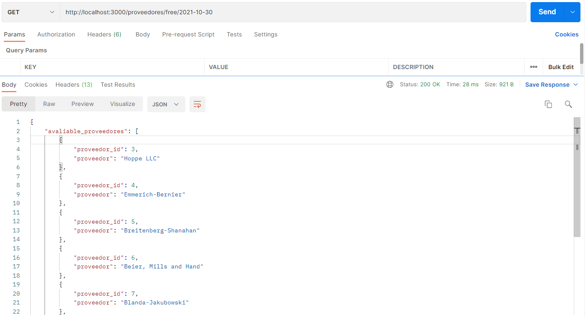
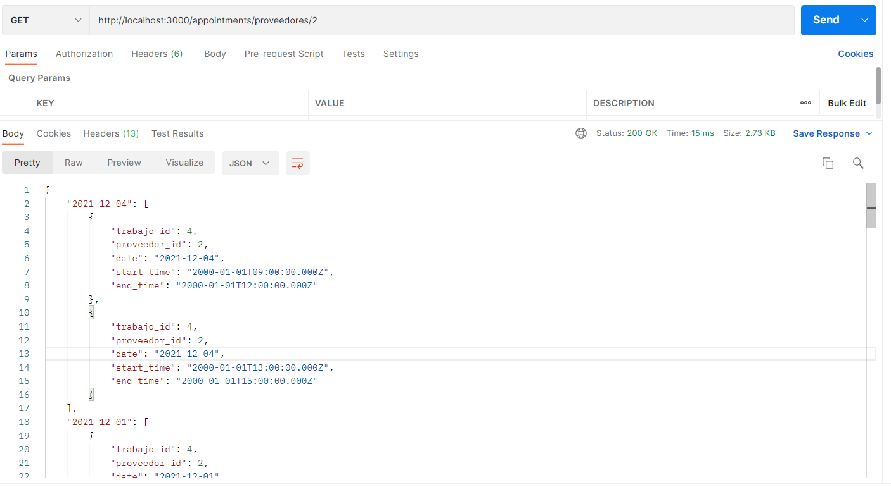
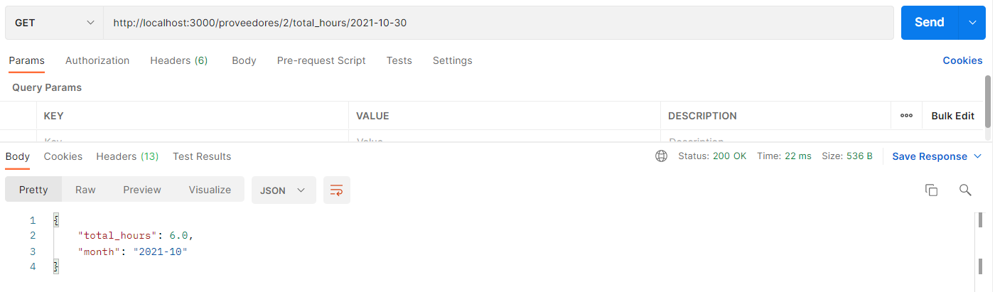

# Mawi Challenge - Ruby on Rails Project 

This project was part of a process at Mawi.
This object of the project was to handle information about providers, jobs and one agenda or appointment for each provider.

# Requirements for the Information

• You must have registered providers.

• Each provider can have "jobs" assigned.

• Each job generates a lock in the supplier's agenda.

• It is distributed by hours and by date.

## This is the ERD made for this project

## Challenges inside the application

1. Create an endpoint to validate if a provider has space for X date and X time.
2. Create an endpoint to get all the providers available on X date.
3. Create an endpoint that returns the jobs of a provider separated by days and ordered descending by an hour and day
4. An endpoint that returns the number of hours that a provider has scheduled per month.

## Solution 

## Live demo link

[try the live demo link](https://mawi-app.herokuapp.com/)

### Formats of the entries in the endpoints

id format: integer - Example: `1`

date format: `%Y-%M-%D` - Example: `2021-10-21`

time format: `%H:%M` - Example: `13:00` 

### 1. End Point -  get `/proveedores/:id/espacio/:date/:hour`

### 2. End Point -  get `/proveedores/free/:date`

### 3. End Point -  get `/appointments/proveedores/:id`

### 4. End Point -  get `/proveedores/:id/total_hours/:date`

## Built and tested With

- Ruby 2.7.4
- Ruby on Rails 6.1.4.1
- Postgres: >=9.5

## Setup

Download the repo with this command

`git clone git@github.com:alejandrotoledoweb/mawi-proveedores.git`

`cd mawi-proveedores`

`git checkout feature-app-mawi`

Install the Gems and Dependencies

`bundle install`

Migrate the database and models, create the seed information

`rails db:create`

`rails db:migrate`

`rails db:seed`

## For the usage

Run the server

`rails server`

Open in the browser `http://localhost:3000/`

## Author

👤 **Alejandro Toledo**

- GitHub: [@alejandrotoledoweb](https://github.com/alejandrotoledoweb)
- Twitter: [@alejot](https://twitter.com/alejot) 
- LinkedIn: [Alejandro Toledo](https://www.linkedin.com/in/alejandro-toledo-3b444b109/) 

## 🤝 Contributing

Contributions, issues and feature requests are welcome!

Feel free to check the [issues page](https://github.com/alejandrotoledoweb/mawi-proveedores/issues).

## Show your support

Give a ⭐️ if you like this project!

## Acknowledgments

- Project inspired and challenged by Mawi.

## 📝 License

This project is [MIT](https://opensource.org/licenses/MIT) licensed.
